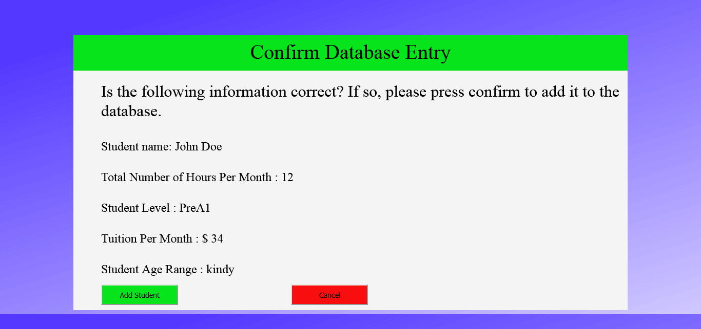
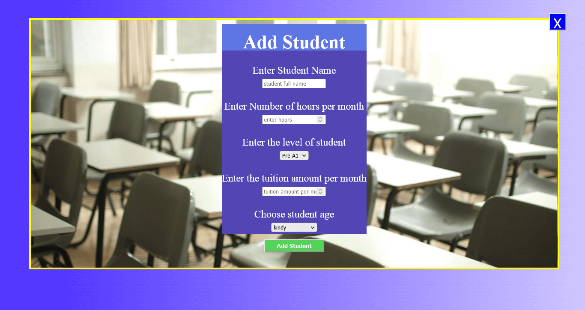

# Student attendance tracker # 

## using Javascript and Firebase ## 

### This app tries to accomplish the following ### 

1. Keep track of students that are registered with the school. 
2. How much tuition each student pays each much. 
3. A dashboard that keeps track of overall expenses and revenue. 
4. Keeps a running total of the number of students. 
5. Very simple currency conversion. 

* Since this is just a simple demo app currently any user can just go to the page and play with the app. Obviously in a real world situation there would be signins and authentication. I feel that since this is just a demo app that potential employers wouldn't want to waste time registering. * 

## here are some sceenshots ## 

	
    
    
